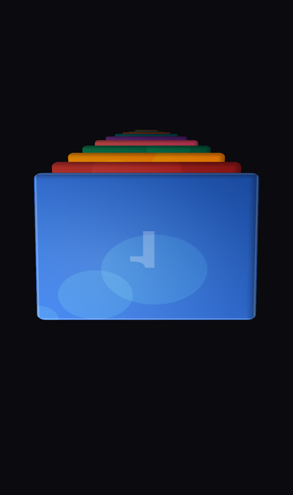

# Zig 3D Depth Stack Carousel


A high-performance 3D image carousel written in **Zig**, compiled to **WebAssembly**, rendered via raw **WebGL2**. No frameworks. No abstractions. 16KB of WASM driving a full touch-interactive 3D experience.


## Why This Exists

Most web carousels are built on top of CSS transforms or Three.js — layers of abstraction that hide the actual work happening on the GPU. This project strips all of that away to answer a question: **what does a carousel look like when you build it from the physics up?**

Every matrix multiply is a SIMD operation. Every frame budget is accounted for. Every byte of memory is pre-allocated. The result is a carousel that runs at 60fps with 8ms of headroom per frame, in a binary smaller than most favicons.

This is also an educational artifact — the code is written to teach how 3D rendering, touch physics, and WebAssembly interop actually work at the lowest level.

## How It Works

### Architecture: Maximum Zig

```
┌─────────────────────────────────────────────────────────┐
│  BROWSER HOST (JavaScript ~200 LOC)                     │
│  Canvas + WebGL2 context + touch/mouse event capture    │
│  Reads Zig's shared memory → issues GPU draw calls      │
└───────────────── ↕ shared linear memory ────────────────┘
┌─────────────────────────────────────────────────────────┐
│  ZIG WASM MODULE (16KB binary)                          │
│                                                         │
│  ┌─ Orchestrator ─────────────────────────────────────┐ │
│  │ frame(dt): drain input → gesture FSM → physics     │ │
│  │            → stack layout → write shared buffers   │ │
│  └────────────────────────────────────────────────────┘ │
│  ┌─ Physics ──────────┐  ┌─ Math (SIMD) ────────────┐ │
│  │ Friction decel      │  │ @Vector(4, f32)          │ │
│  │ Damped spring snap  │  │ mat4 perspective/lookAt  │ │
│  │ 5-state gesture FSM │  │ 128-bit WASM SIMD ops    │ │
│  └─────────────────────┘  └──────────────────────────┘ │
│  ┌─ Memory ───────────────────────────────────────────┐ │
│  │ Pre-allocated transform buffers (zero hot-path     │ │
│  │ allocations), lock-free input ring buffer (1KB)    │ │
│  └────────────────────────────────────────────────────┘ │
└─────────────────────────────────────────────────────────┘
         ↓ 1 instanced draw call per frame
┌─────────────────────────────────────────────────────────┐
│  GPU (WebGL2)                                           │
│  Instanced quad rendering + sampler2DArray textures     │
│  Shader effects: depth blur, rounded corners, glow      │
└─────────────────────────────────────────────────────────┘
```

**Zig owns all compute.** Physics, matrix math, gesture detection, visibility culling, layout — all happen in WASM with SIMD acceleration. JavaScript is a thin GPU driver (~200 lines) that reads shared memory and issues WebGL2 calls.

**One draw call per frame.** All 12 cards render via a single `drawArraysInstanced` call. Per-card transforms, opacities, and texture indices are passed as instance attributes. Zero state changes between cards.

### The Rendering Pipeline

Each frame follows this exact sequence within a 16.67ms budget:

| Phase | Time | What Happens |
|-------|------|-------------|
| **Input** | 0.2ms | JS writes touch events to shared memory ring buffer |
| **Gesture** | 0.3ms | Zig FSM: idle → pressed → dragging → flinging → snapping |
| **Physics** | 0.3ms | Frame-rate independent friction (`v *= 0.94^(dt/ref)`) + critically damped spring (stiffness=300, ζ=1.0) |
| **Layout** | 0.5ms | 12 card transforms via SIMD mat4 multiply. Exponential Z-spacing, per-card scale/opacity/tilt |
| **Cull** | 0.1ms | Skip invisible cards. Write visible transforms to shared buffer |
| **JS Read** | 0.3ms | Read transforms from WASM memory. Upload to instance buffers |
| **GPU** | 5ms | Vertex shader (instanced transforms) → Fragment shader (texture array + depth blur + rounded corners + glow) |
| **Margin** | ~8ms | Headroom for variance |

### The Depth Stack Model

Cards are arranged in Z-depth with these per-card formulas (where `i` is the card's distance from the focused card):

```
z_position = exponential spacing (deeper cards spread further apart)
scale      = max(0.3, 1.0 - i * 0.08)
opacity    = max(0.1, 1.0 - i * 0.075)
y_offset   = i * 0.12 (cards shift upward as they recede)
tilt       = i * 0.015 radians (subtle fan effect)
```

### Touch Physics

The gesture system is a 5-state finite state machine:

```
IDLE → (touch) → PRESSED → (move > 8px) → DRAGGING
                          → (release)    → TAP (expand card)

DRAGGING → (release, fast) → FLINGING → (velocity < threshold) → SNAPPING → IDLE
         → (release, slow) → SNAPPING → IDLE

FLINGING/SNAPPING → (touch) → DRAGGING (interrupt — catch mid-motion)
```

- **Drag**: 1:1 finger tracking, velocity sampled over last 5 frames
- **Fling**: Exponential friction decay (~300ms settling)
- **Snap**: Critically damped spring to nearest card (~200ms, no bounce)
- **Total gesture→settled: ~500ms** — matches iOS-quality feel

### Progressive Image Loading

Four quality tiers loaded based on distance from focus:

| Tier | Resolution | When | Cards |
|------|-----------|------|-------|
| 0 | Solid color | Instant | All |
| 1 | 64×64 | On init | Far (6+) |
| 2 | 256×256 | When near | Near (±3) |
| 3 | 512×512 | On focus | Focused (0) |

Textures upload during idle frames (only when frame time < 12ms). LRU eviction keeps memory bounded.

## Screenshots

| Front View | Scrolled | Mobile |
|-----------|----------|--------|
|  |  |  |

## Quick Start

### Prerequisites

- [Zig 0.15+](https://ziglang.org/download/)
- Python 3 (for local dev server) or any static file server
- A browser with WebGL2 support

### Build & Run

```bash
# Build WASM (outputs to web/carousel.wasm)
zig build

# Run tests
zig build test

# Serve locally
python3 -m http.server 8080 --directory web
```

Open **http://localhost:8080** — drag, fling, snap, tap to expand.

### Binary Size

```
web/carousel.wasm    16,031 bytes
web/host.js          ~8 KB
web/shaders/         ~2 KB
web/index.html       ~0.5 KB
─────────────────────────────
Total                ~27 KB (before gzip)
```

## Project Structure

```
zig-image-carousel/
├── build.zig                 # wasm32-freestanding + SIMD128, ReleaseSmall
├── build.zig.zon             # Package manifest
│
├── src/                      # Zig source (compiles to WASM)
│   ├── main.zig              # WASM exports: init(), frame(dt), resize()
│   ├── vec.zig               # Vec3/Vec4 via @Vector(4, f32) — SIMD
│   ├── mat4.zig              # 4×4 column-major matrices — perspective, lookAt
│   ├── stack.zig             # Depth stack layout engine — 12 card transforms
│   ├── input.zig             # Lock-free ring buffer — JS→WASM event pipe
│   ├── gesture.zig           # 5-state touch FSM — drag/fling/snap/tap
│   ├── physics.zig           # Friction deceleration + critically damped spring
│   └── ease.zig              # Easing functions for animations
│
├── web/                      # Browser host
│   ├── index.html            # Full-viewport canvas
│   ├── host.js               # WebGL2 GPU driver (~200 LOC core)
│   ├── carousel.wasm         # Build output
│   └── shaders/
│       ├── card.vert         # Instanced vertex shader
│       └── card.frag         # Texture array + depth blur + rounded corners
│
└── docs/
    ├── screenshots/          # Visual documentation
    └── superpowers/
        ├── specs/            # Design specification
        └── plans/            # Implementation plan
```

## Key Technical Decisions

| Decision | Why |
|----------|-----|
| **wasm32-freestanding** (not emscripten) | Zero dependencies, 16KB binary vs ~100KB+ with emscripten glue |
| **@Vector(4, f32)** for all math | Compiles directly to WASM SIMD128 instructions. 4×f32 fits perfectly in 128-bit SIMD registers |
| **Column-major Mat4 as [4]Vec4** | Matches GLSL mat4 memory layout. Matrix multiply becomes 4 SIMD dot products |
| **Lock-free ring buffer** | JS writes at head, Zig reads at tail. No locks needed for single-producer/single-consumer. Handles 120Hz touch → 60Hz frame |
| **Critically damped spring (ζ=1.0)** | Fastest possible settling without oscillation. Matches native iOS/Android scroll physics |
| **Frame-rate independent physics** | Friction: `pow(0.94, dt/reference_dt)`. Works identically at 30fps, 60fps, or 120fps |
| **Single drawArraysInstanced** | 1 draw call for all visible cards. Instance attributes carry per-card mat4 + opacity + texture layer |
| **sampler2DArray** | 1 texture binding for all card images. GPU indexes by layer. Zero texture state changes |
| **Pre-allocated everything** | Zero allocations in the hot path. All buffers sized at compile time |

## Physical Constraints Respected

This project is built from an understanding of the hardware constraints that actually matter:

- **WASM SIMD**: 128-bit only (4×f32). All matrix ops designed to fit single SIMD passes
- **WASM memory**: Linear, grows in 64KB pages, never shrinks. Pre-allocate everything
- **JS↔WASM boundary**: Only i32/i64/f32/f64 cross the boundary. Complex data via shared memory pointers
- **GPU frame budget**: 16.67ms total. Zig+JS must finish in <8ms to leave GPU headroom
- **Texture upload**: Async via createImageBitmap. Never blocks the main thread
- **Touch sampling**: 120Hz on modern devices → 60Hz frames. Ring buffer absorbs burst

## Roadmap

### Completed

- [x] **Gate 0**: Zig → WASM → WebGL2 pipeline (rotating quad proof)
- [x] **Gate 1**: 12-card depth stack with SIMD math + instanced rendering
- [x] **Gate 2**: Touch/mouse interaction — drag, fling, snap physics
- [x] **Gate 3**: Progressive image loading + visibility culling
- [x] **Gate 4**: Visual polish — depth blur, rounded corners, glow, tap-to-expand

### Planned

- [ ] **Real photo loading**: Fetch actual images from URLs, not generated gradients
- [ ] **WebGPU renderer**: Swap JS WebGL2 driver for WebGPU when available (Zig compute stays identical)
- [ ] **Card content overlays**: HTML/CSS overlay layer for titles, descriptions on cards
- [ ] **Keyboard navigation**: Arrow keys + Enter for accessibility
- [ ] **Haptic feedback**: Vibration API on snap events (mobile)
- [ ] **120fps mode**: Detect ProMotion/high-refresh displays, halve the frame budget
- [ ] **Infinite scroll**: Virtual card pool with recycling for unlimited card sets
- [ ] **Custom card shapes**: Non-rectangular cards via SDF masking in fragment shader
- [ ] **Shared Element Transitions**: Animate card expand into a full page view
- [ ] **npm package**: Publish as a web component with `<depth-carousel>` custom element

## Performance

| Metric | Value |
|--------|-------|
| WASM binary | 16,031 bytes |
| Frame time (typical) | ~8ms |
| Draw calls/frame | 1 |
| Texture bindings/frame | 1 |
| State changes/frame | 0 |
| Hot-path allocations | 0 |
| Touch-to-pixel latency | <1 frame |
| Gesture→settled time | ~500ms |
| Initial memory | 2MB |
| Max memory | 4MB |

## License

MIT

## Acknowledgments

Built with insights from:
- **Addy Osmani** — web performance patterns, progressive loading strategies
- **Emil Kowalski** — motion design principles for touch interactions
- The Zig community — WASM target support and SIMD documentation
